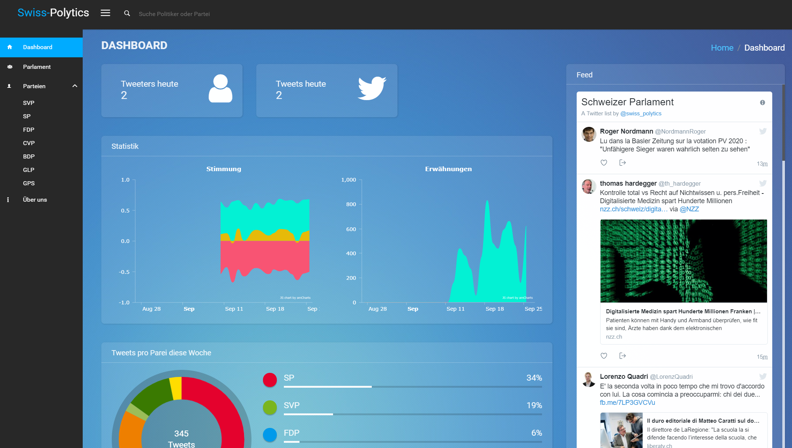

# Swiss-Polytics

</a>

## What is it?
The main goal of this project is to show the twitter activities of all politicians in the swiss parliament.

## Based on
We used the following Angular dashboard as a starter for this project: https://github.com/akveo/ngx-admin

## Technologies
Angular, Angular CLI, Bootstrap 4, and lots of awesome modules and plugins

## Getting started
- yarn or npm install
- ng serve or npm start
- If you see errors caused by the SASS compilation you may need to do the following: npm install --global windows-build-tools
- go to `http://localhost:4200/`

## Backend
The corresponding backend service used for this project is on Github as well: 
https://github.com/AdrianKrebs/poliytics-backend

## Deploy to Github Pages
ng build --env=prod --base-href "/swiss-polytics/"
angular-cli-ghpages

Deployed Demo: https://adriankrebs.github.io/swiss-polytics/

## How can I support developers?
- Star our GitHub repo :star:
- Create pull requests, submit bugs, suggest new features or documentation updates :wrench:
- Follow us on [Twitter](https://twitter.com/swiss_polytics) :feet:

## License
[MIT](LICENSE.txt) license.

### From Swiss-Polytics

Enjoy :metal:
We're always happy to receive your feedback!

